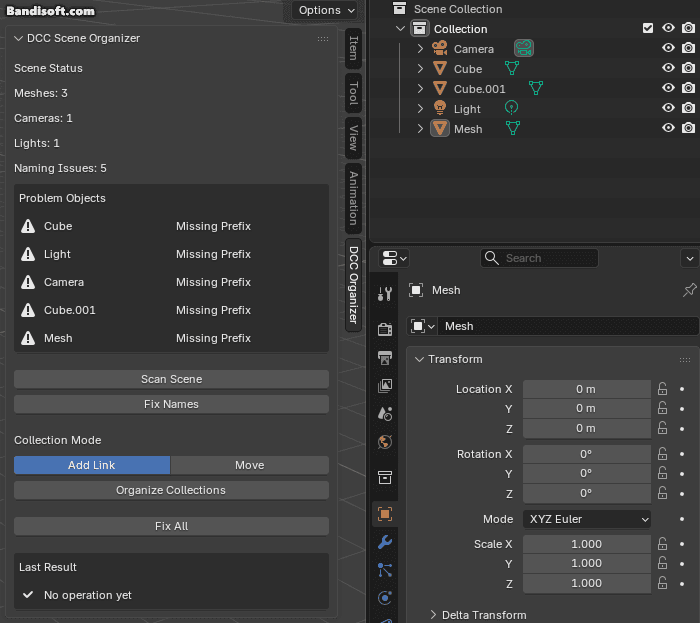
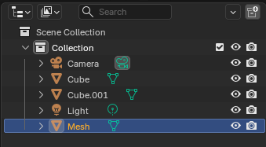
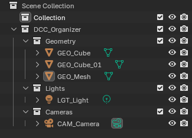
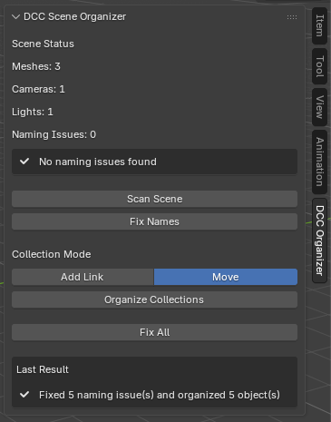

# DCC Scene Organizer

A Blender Python tool for validating object naming conventions and organizing scene collections.

DCC Scene Organizer was developed as a Technical Artist portfolio project to reduce repetitive scene-cleanup tasks and help maintain consistent naming and collection structures during 3D production.

---

## Demo



**Messy Scene → Fix All → Organized Scene**

The tool scans the current scene, detects naming issues, automatically fixes supported problems, and organizes objects into predefined collections.

---

## Overview

During 3D production, scenes can quickly become difficult to manage because of:

- Inconsistent object naming
- Blender default names such as `Cube.001`
- Mixed object types across collections
- Repetitive manual cleanup
- Naming conflicts caused by duplicated objects

DCC Scene Organizer automates these cleanup tasks while providing both non-destructive and destructive collection-management options.

---

## Before / After

### Before

An example of an unorganized scene:



```text
Scene Collection
├── Cube
├── Cube.001
├── Mesh
├── Light
└── Camera
```

The tool detects objects that do not follow the naming convention and displays them as naming issues.

### After

After running **Fix All**:



```text
DCC_Organizer
├── Geometry
│   ├── GEO_Cube
│   ├── GEO_Cube_01
│   └── GEO_Mesh
├── Lights
│   └── LGT_Light
└── Cameras
    └── CAM_Camera
```

---

## Features

### Scene Scan

Scans supported objects in the current Blender scene.

Supported object types:

- Mesh
- Camera
- Light

---

### Naming Convention Validation

Objects are validated according to predefined prefix rules.

| Object Type | Prefix |
| --- | --- |
| Mesh | `GEO_` |
| Camera | `CAM_` |
| Light | `LGT_` |

Example:

```text
Cube   → GEO_Cube
Camera → CAM_Camera
Light  → LGT_Light
```

---

### Blender Suffix Cleanup

Blender-generated suffixes such as `.001` are automatically detected.

Example:

```text
GEO_Cube.001
↓
GEO_Cube_01
```

---

### Name Collision Handling

Before assigning a numbered name, the tool checks whether the target name already exists.

For example, if these objects already exist:

```text
GEO_Cube_01
GEO_Cube_02
GEO_Cube_03
```

and a new object named:

```text
Cube.001
```

is processed, the tool finds the next available number:

```text
Cube.001
↓
GEO_Cube_04
```

This prevents duplicate naming conflicts.

---

## Collection Organization

Objects are organized under a dedicated root collection.

```text
DCC_Organizer
├── Geometry
├── Cameras
└── Lights
```

### Add Link

Keeps the object's existing collection links and also links the object to the appropriate `DCC_Organizer` collection.

This provides a non-destructive workflow that preserves the artist's existing collection structure.

### Move

Removes previous collection links and moves the object into the appropriate `DCC_Organizer` collection.

Because this operation modifies the existing scene structure, a confirmation dialog is displayed before execution.

---

## Fix All

The **Fix All** operation combines the main cleanup processes into one action.

```text
Scene Scan
    ↓
Naming Validation
    ↓
Auto Rename
    ↓
Name Collision Check
    ↓
Collection Organization
```

This allows common scene-cleanup tasks to be performed with a single button.

---

## User Interface



The sidebar UI provides:

- Scene object counts
- Naming issue count
- Problem object display
- Scan Scene
- Fix Names
- Add Link / Move selection
- Organize Collections
- Fix All
- Last Result feedback

Example:

```text
Scene Status

Meshes: 3
Cameras: 1
Lights: 1
Naming Issues: 0

No naming issues found
```

---

## Problem Detection

When naming problems are found, they are displayed directly in the UI.

Example:

```text
Problem Objects

Cube             Missing Prefix
GEO_Cube.001     Blender Suffix
```

This allows the user to identify problematic objects without checking the system console.

---

## User Feedback

The result of the most recent operation is stored and displayed in the tool panel.

Example:

```text
Last Result

Fixed 2 naming issue(s)
```

or:

```text
Fixed 2 naming issue(s) and organized 5 object(s)
```

Warnings are also displayed when an operation cannot be completed.

---

## Safety Features

The tool includes several safeguards for scene editing:

- Undo support
- Confirmation dialog for Move operations
- Non-destructive Add Link mode
- Empty-scene handling
- Name collision prevention
- Duplicate collection prevention
- Repeated execution stability
- Runtime error handling

---

## Testing

The tool was tested under several scene conditions.

### Test 01 — Clean Scene

A scene that already follows the expected naming and collection rules.

Verified:

- No unnecessary naming changes
- No duplicate collections
- No duplicate links
- No errors during repeated execution

**Result: Passed**

---

### Test 02 — Messy Naming

Input:

```text
Cube
Cube.001
Mesh
Light
Camera
```

Expected result:

```text
GEO_Cube
GEO_Cube_01
GEO_Mesh
LGT_Light
CAM_Camera
```

**Result: Passed**

---

### Test 03 — Number Collision

Existing objects:

```text
GEO_Cube_01
GEO_Cube_02
GEO_Cube_03
```

New object:

```text
Cube.001
```

Result:

```text
GEO_Cube_04
```

**Result: Passed**

---

### Test 04 — Complex Collections

Tested with existing custom collections such as:

```text
Character
Props
TestCollection
```

Verified:

- Add Link preserves existing collection links
- Move removes previous collection links
- Undo restores the previous scene state

**Result: Passed**

---

### Test 05 — Empty Scene

When no supported objects are found, the operation is safely cancelled.

```text
No supported objects found
```

**Result: Passed**

---

### Test 06 — Repeated Execution

`Fix All` was executed repeatedly on an already organized scene.

Verified:

- No duplicate names
- No duplicate collections
- No duplicate links
- No execution errors
- Scene structure remains stable
- Last Result updates correctly

**Result: Passed**

---

## Usage

1. Open Blender.
2. Open the **Scripting** workspace.
3. Load `scene_organizer.py`.
4. Click **Run Script**.
5. Return to the 3D Viewport.
6. Press `N` to open the sidebar.
7. Open the **DCC Organizer** tab.
8. Use the required operation:
   - Scan Scene
   - Fix Names
   - Organize Collections
   - Fix All

---

## Project Structure

```text
DCC-Scene-Organizer/
│
├── README.md
├── scene_organizer.py
│
├── screenshots/
│   ├── before.png
│   ├── after.png
│   └── ui.png
│
└── demo/
    └── dcc_scene_organizer.gif
```

---

## Technical Structure

The script is separated into several functional areas.

```text
Scene Scan
↓
Naming Validation
↓
Rename Logic
↓
Collection Organization
↓
Scene Status
↓
Blender Operators
↓
UI Panel
```

### Technologies

- Python
- Blender Python API (`bpy`)
- Regular Expressions (`re`)

---

## Development Goals

This project was created not only to automate scene cleanup, but also to explore Technical Artist tool-development concepts such as:

- Artist workflow automation
- Naming convention management
- Scene validation
- Non-destructive workflows
- Safe destructive operations
- Undo support
- Error handling
- User feedback
- Repeated-operation stability
- Tool usability

The main goal was to approach the project as a tool that could be safely used by an artist, rather than as a simple one-time automation script.

---

## Future Improvements

Possible future improvements include:

- Custom naming presets
- User-defined prefix rules
- Support for additional Blender object types
- Batch validation
- Exportable validation reports
- Blender add-on packaging
- 3ds Max version
